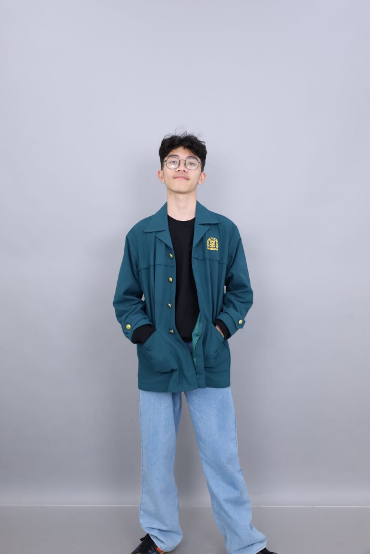

  <h1>🌙 All About Me</h1>

  

  <h2>✨ Siapa Saya?</h2>
  

    Halo, saya <b>Daniel Benaya Toar Supaath</b>.  
    Saya pribadi yang tenang, observatif, dan lebih senang memahami daripada berbicara.
    Hidup bagi saya adalah perjalanan bertahap—perlahan namun pasti.
  

  <h2>🤝 Cara Saya Berinteraksi</h2>
  

    Saya pendengar yang baik dan percaya bahwa tawa menciptakan kedekatan.  
    Bagi saya, hubungan dibangun dari ruang aman, bukan dari kebisingan.
  

  <h2>🌱 Kisah yang Membentuk Saya</h2>
  

    Ada masa di mana ketakutan membuat saya berhenti melangkah.  
    Namun saya belajar bahwa keberanian bukan tentang tidak takut—melainkan tetap berjalan meski takut.
  

  <h2>💡 Nilai yang Saya Pegang</h2>
  

    Saya percaya pada tanggung jawab, ketenangan, belajar terus, dan menjadi tempat aman bagi orang lain.
  

  <h2>🌟 Refleksi & Harapan</h2>
  <blockquote>
    "Saya bukan orang yang banyak bicara, tapi saya selalu berusaha memahami."
  </blockquote>
  

    Saya ingin bertumbuh menjadi versi terbaik dari diri saya—perlahan, tenang, dan penuh makna.
  

