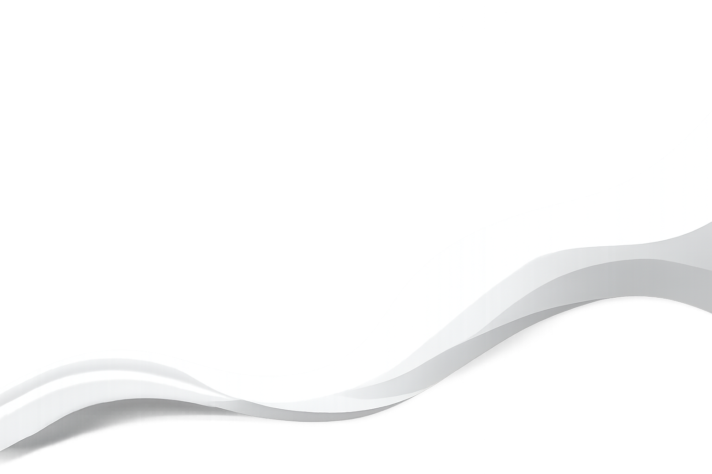

::: {.hero-container}

::: {.hero-content}

::: {.hero-left}
<h1 class="welcome-text">WELCOME</h1>

  Selamat datang di website pribadi saya!

  Website ini dibuat untuk memenuhi CPMK mata kuliah
  <b>II2100 Komunikasi Interpersonal dan Publik</b>
  pada Program Studi Sistem dan Teknologi Informasi.

<a href="All_About_me/" class="btn-explore">Explore Now</a>
:::

::: {.hero-right}
::: {.menu-box}

### UTS
* **UTS 1** – [All About Me](All_About_me/index.qmd)
* **UTS 2** – [My Songs For You](My_Song_for_You/index.qmd)
* **UTS 3** – [My Stories For You](My_Stories_for_You/index.qmd)
* **UTS 4** – [My SHAPE](My_Shapes/index.qmd)
* **UTS 5** – [My Personal Reviews](My_Personal_Reviews/index.qmd)

 

### UAS
* **UAS 1** – [My Concept](My_Concepts/index.qmd)
* **UAS 2** – [My Opinions](My_Opinions/index.qmd)
* **UAS 3** – [My Innovations](My_Innovations/index.qmd)
* **UAS 4** – [My Knowledge](My_Knowledge/index.qmd)
* **UAS 5** – [My Professional Reviews](My_Professional_Reviews/index.qmd)

:::
:::

:::
:::